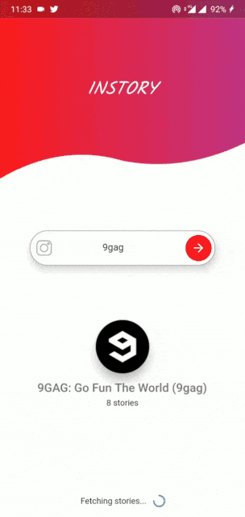
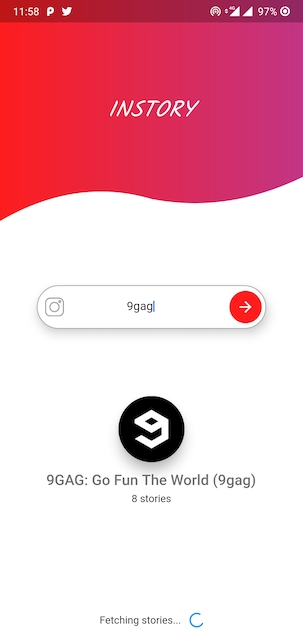

# Instory 📽

<h4 align="center">
 🦋Beautiful flutter app for downloading Instagram stories 🚀
</h4>
 
 
  
 

<table><tr>
  <td style="text-align: center">
     </a>
</td>
<td style="text-align: center">
 
 </td>
<td style="text-align: center">
 
 </tr></table>
 

 

### Dependenices used

- [video_player](https://pub.dartlang.org/packages/video_player)
- [http](https://pub.dartlang.org/packages/http)
- [dio](https://pub.dartlang.org/packages/dio)
- [path_provider](https://pub.dartlang.org/packages/path_provider)
- [permission_handler](https://pub.dartlang.org/packages/permission_handler)

For help getting started with Flutter, view   
[online documentation](https://flutter.io/docs), which offers tutorials, 
samples, guidance on mobile development, and a full API reference.
